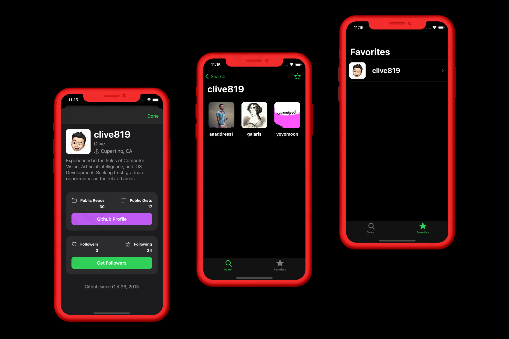

# Github Followers

Github Followers is the first 100% programmatic UI (no storyboard) app that I built. It was a lot of fun making Github Followers. I  gained experience and knowledge with some of Apple’s cool frameworks and features.

# Things I Learned

-   Properly handle image loading using *Smalltalk MVC*.
-   Support light & dark mode.
-   Setup empty state view for *UICollectionView* or *UITableView*.
-   Utilizing custom *UICollectionViewFlowLayout* to layout *UICollectionView*.
-   Layout UI programmatically without using storyboards.
-   Combine *UISearchController* and *NSDiffableDataSourceSnapshot* to create a smooth animation while searching.

# Technologies Used

-   DiffableDataSource, UserDefaults, Delegate
-   UIKit, SafariServices
-   Singleton, Smalltalk MVC, MVC

# Screenshot

# Credit

This is a take home project from [Sean Allen](https://seanallen.teachable.com/p/take-home).